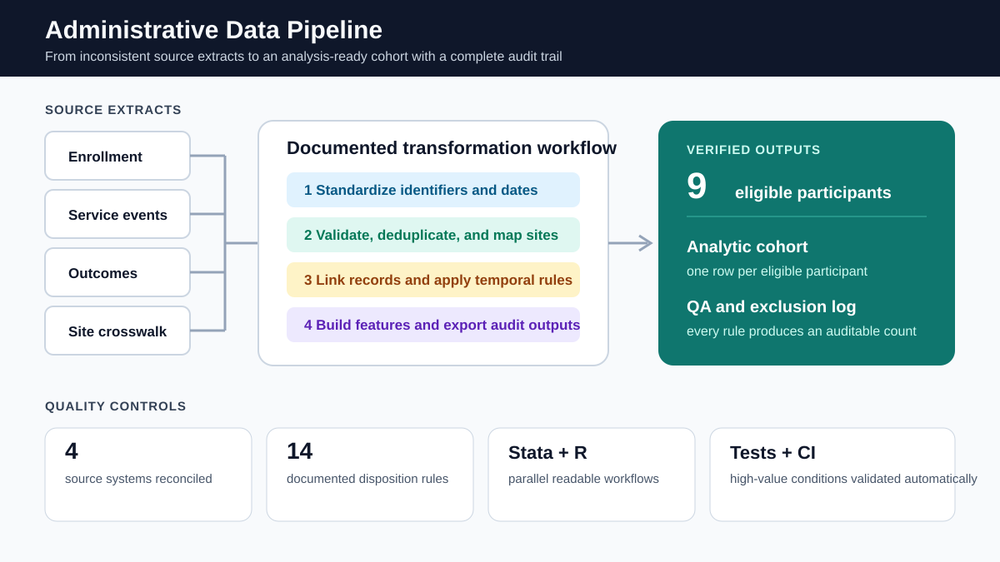

# Administrative data pipeline

A reproducible pipeline for turning four inconsistent administrative extracts into an analysis-ready participant file. The project emphasizes the work that often determines whether an analysis is credible: identifier standardization, date parsing, duplicate resolution, record linkage, temporal rules, exclusion tracking, and independent quality checks.

The fixtures are synthetic and intentionally messy. They do not represent a client, organization, or participant.

## Scenario

A multisite service program delivers participant-level files from separate enrollment, service, outcome, and site systems. The extracts disagree on capitalization and date formats, contain duplicate records, and include invalid scores, implausible service durations, orphaned identifiers, and events outside eligible windows.

The pipeline answers two operational questions:

1. Can the extracts be reconciled into one trustworthy analytic cohort?
2. Which records were changed or excluded, and can those decisions be audited?

## What the pipeline does

~~~mermaid
flowchart LR
    A["Four raw extracts"] --> B["Standardize fields"]
    B --> C["Validate and deduplicate"]
    C --> D["Link records"]
    D --> E["Apply temporal rules"]
    E --> F["Build participant features"]
    F --> G["Export cohort and QA log"]
~~~

The output is one row per eligible participant with enrollment characteristics, service-use measures, latest valid follow-up score, and improvement from baseline. Every exclusion rule contributes an aggregate count to the QA log.

## Implementations

- **Stata:** the primary, modular workflow in `stata/`
- **R:** a companion implementation in `R/pipeline.R`
- **Automated validation:** fixture and structural checks in `tests/validate_fixtures.py`
- **Continuous integration:** GitHub Actions validates the raw fixtures and runs the R pipeline

The two implementations are deliberately readable rather than compressed. Intermediate checks are visible so another analyst can review what changed and why.

## Repository structure

~~~text
data/raw/
  enrollment.csv
  service_events.csv
  outcomes.csv
  site_crosswalk.csv
docs/
  data-dictionary.md
  quality-rules.md
  expected-audit.md
R/
  pipeline.R
stata/
  00_master.do
  01_clean_enrollment.do
  02_clean_services.do
  03_clean_outcomes.do
  04_build_analytic_file.do
tests/
  validate_fixtures.py
  test_pipeline.R
~~~

## Run it

### R

~~~r
install.packages(c("dplyr", "readr", "stringr", "tibble"))
source("R/pipeline.R")
run_pipeline()
~~~

The pipeline writes:

- `outputs/analytic_cohort.csv`
- `outputs/exclusion_log.csv`
- `outputs/qa_summary.csv`

### Stata

From the repository root:

~~~stata
do "stata/00_master.do"
~~~

The Stata workflow writes staged `.dta` files to `data/processed/` and equivalent audit outputs to `outputs/`.

## Quality philosophy

An automated check is evidence, not a substitute for judgment. Each exclusion is tied to a documented rule, source record counts are preserved, and ambiguous records are surfaced rather than silently repaired. In a production project, thresholds and disposition rules would be approved with the data owner and subject-matter team before delivery.

## Skills demonstrated

Advanced Stata data management · R · multisource joins · reshaping and aggregation · identifier standardization · duplicate resolution · temporal validation · feature engineering · audit trails · reproducible pipelines · GitHub Actions

## License

MIT
